# DashAgent Architecture: Dashboard Extension

## Overview

DashAgent uses a **Dashboard Extension** as the primary interface for AI-powered dashboard analysis and control.

### Current State: Dashboard Extension

```mermaid
flowchart TB
    subgraph Tableau["Tableau Desktop/Server"]
        subgraph Dashboard["Dashboard"]
            WS1["Worksheet 1"]
            WS2["Worksheet 2"]
            subgraph DashExt["DashAgentTool Extension Zone"]
                Chat["💬 Chat Panel"]
                Design["🎨 Design Panel"]
                Preview["👁️ Preview Panel"]
            end
        end
    end
    
    User["👤 User"] --> Chat
    Chat <-->|"Natural Language"| MCP["MCP Server"]
    MCP <-->|"AI Responses"| LLM["Claude LLM"]
    MCP -->|"Read Data/Filters"| WS1
    MCP -->|"Apply Filters"| WS2
```


The entire UI (chat, design, preview) lives in a Dashboard Zone. Users interact directly with the extension.

---

## Architecture: Dashboard Extension as Controller

```mermaid
flowchart TB
    subgraph Tableau["Tableau Workbook"]
        subgraph Dashboard["Dashboard View"]
            WS1["Worksheet 1\n(Native Chart)"]
            WS2["Worksheet 2\n(Native Chart)"]
            
            subgraph DashExt["DashAgentTool\n(Controller)"]
                Chat["💬 Chat with AI"]
                Preview["📊 Rendered KPIs"]
            end
        end
    end
    
    subgraph Backend["Backend Services"]
        MCP["MCP Server\n:3001"]
        LLM["Claude AI"]
    end
    
    User["👤 User"] -->|"Chat"| Chat
    Chat <-->|"WebSocket"| MCP
    MCP <-->|"API"| LLM
    
    MCP -->|"Read Data"| WS1
    MCP -->|"Apply Filters"| WS2
    
    DashExt <-->|"Control"| MCP
```



### User Workflow:
1. User opens Dashboard with DashAgentTool extension
2. User chats with AI through the extension
3. Agent analyzes data, provides insights, and can manipulate the dashboard
4. AI can render custom visualizations directly in the extension canvas

---

## System Architecture

```mermaid
flowchart TB
    subgraph User["User Interactions"]
        U1["💬 Chat in Dashboard Ext"]
        U3["📌 Right-click Context Menu"]
    end
    
    subgraph Tableau["Tableau Workbook"]
        subgraph Dash["Dashboard"]
            DE["DashAgentTool\n(Main Controller)"]
            Native1["Native Charts"]
            Native2["Native Charts"]
        end
    end
    
    subgraph MCP["MCP Server"]
        Bridge["WebSocket Bridge"]
        Tools["Tool Handlers"]
        
        subgraph DashTools["Dashboard Tools"]
            T1["get-dashboard-info"]
            T2["apply-filter"]
            T3["generate-documentation"]
            T4["build-dashboard"]
            T5["render-visualization"]
        end
    end
    
    LLM["Claude AI"]
    
    U1 --> DE
    U3 --> DE
    
    DE <-->|"Dashboard WebSocket"| Bridge
    
    Bridge --> Tools
    Tools --> DashTools
    Tools <--> LLM
```



---

## Data Flow: Creating a Custom Visualization

```mermaid
sequenceDiagram
    participant Userension"]
    end
    
    subgraph Tableau["Tableau Workbook"]
        subgraph Dash["Dashboard"]
            DE["DashAgentTool\n(Main Controller)"]
            Native1["Native Charts"]
            Native2["Native Charts"]
        end
    end
    
    subgraph MCP["MCP Server"]
        Bridge["WebSocket Bridge"]
        Tools["Tool Handlers"]
        
        subgraph DashTools["Dashboard Tools"]
            T1["get-dashboard-info"]
            T2["apply-filter"]
            T3["generate-documentation"]
            T4["render-component"]
            T5["analyze-design"]
        end
    end
    
    LLM["Claude AI"]
    
    U1 --> DE
    DE <-->|"WebSocket :3001"| Bridge
    Bridge --> Tools
    Tools --> Dashiz: ext_789"]
        end
    end
    
    DE <-->|"ws://localhost:8768"| WS
    VE <-->|"ws://localhost:8768"| WS
    WS --> C1
    WS --> C2
    WS --> C3
```

---

## File Structure

```
DashAgentTool/
├── packages/
│   ├── extension/           # Dashboard Extension (Controller)
│   │   ├── index.html       # Entry point
│   │   ├── config.html      # Main UI with Chat/Design/Preview
│   │   ├── manifest.trex    # <dashboard-extension>
│   │   └── vite.config.ts   # Dev server :5173
│   │

│   └── mcp-server/          # Shared Backend
│       ├── src/
│       │   ├── index.ts             # MCP protocol handler
│       │   ├── websocket-bridge.ts  # Multi-client WebSocket
│       │   └── tools/
│       │       └── index.ts         # All tools (dash + viz)
│       └── dist/            # Compiled output
```
│   │   ├── index.html       # Entry point
│   │   ├── config.html      # Main UI with Chat/Design/Preview
│   │   ├── manifest.trex    # <dashboard-extension>
│   │   ├── src/             # TypeScript source files
│   │   └── vite.config.ts   # Dev server :5173
│   │
│   └── mcp-server/          # Backend Server
│       ├── src/
│       │   ├── index.ts             # MCP protocol handler
│       │   ├── websocket-bridge.ts  # WebSocket connection
│       │   └── tools/
│       │       └── index.ts         # All dashboard tools

---

## Next Steps

1. 🔧 Test end-to-end dashboard workflows
2. 📝 Finalize README and docs
3. ✅ Confirm MCP tools exposures and run build

| Mode | Location | UI | Capabilities |
|------|----------|-----|--------------|
| **Chat** | Dashboard Extension | Full chat panel | Ask questions, generate docs, control dashboard |
| **MCP Tools** | VS Code / Claude Desktop | CLI/Chat | Direct tool invocation |

### Key Design
The **Dashboard Extension is the control center**. Users interact with AI through the extension, and the agent can:
- Analyze dashboard data and structure
- Apply filters and set parameters
- Render custom insights and visualizations
- Generate documentation and reports
- Provide design critiques and recommendat